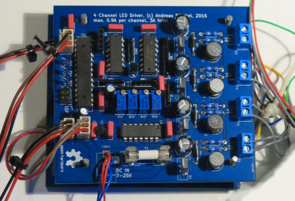
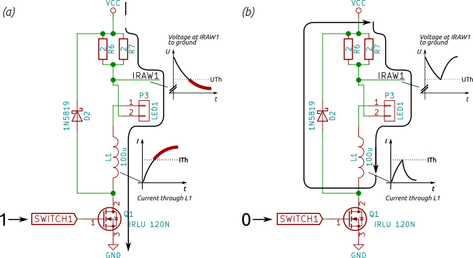
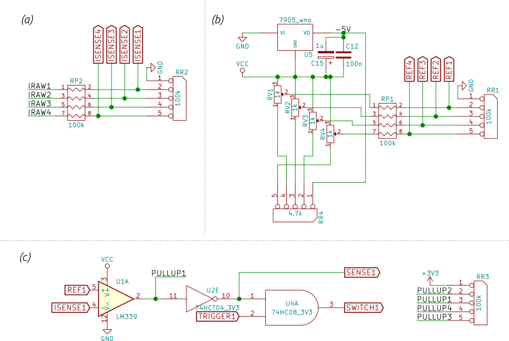

# LED Controller
## 4 Channel Buck LED Controller



This repository contains the schematics and gerber files for a four channel high power LED constant current source with integrated PWM dimmer. The circuit is entirely built from easily sourcable
through-hole components, and the two-layer PCB can be cheaply manufactured (about 15$ for ten boards, excl. shipping, total cost of one board will be about 20$, with high precision trimmer potentiometers and the AVR microcontroller being the most expensive parts).


## Specifications

* 7-25V DC input voltage
* Up to 0.9A per channel, up to 3A per board
* Daisy-chainable UART for setting LED brightness in 4096 steps using an AVR µC
* Automated ramping with configurable speed

## About

This board is my first attempt at building a driver for high-power LEDs. LEDs in general must be driven with a constant current. A simple in-series resistor is often used for low-power LEDs, yet this approach is highly inefficient for high-power LEDs with several watts. A common technique for producing constant currents with high efficiency are so called [buck converters](https://en.wikipedia.org/wiki/Buck_converter).

Here, I designed a low-side switched buck converter from scratch without any specialized circuitry. Bare in mind that you probably shouldn't do this, since integrated solutions exist which are much cheaper, smaller, and safer to use. However, they lack most of the learning experience.

The entire circuit was designed on a bread board, and should you really intend to use it I'd strongly recommend to make yourself familiar with the circuit on a bread board first―though in that case you should go with a stripped down one-channel version.

Two of the PCBs are now at the heart of a wake-up light alarm-clock thingy with 36 high power LEDs (4 red, 4 green, 4 blue, 4 yellow, 20 white) in eight channels at 21.5V/300mA each and a total nominal light output of 3600 lumen. Which is fairly bright.

Schematic and board layout can be opened with [KICAD](http://kicad-pcb.org/). Important parts of the schematic are included below as images (missing: 3V3 power supply and lots of capacitors).

**Important:**
This is the first PCB I ever built and I am by no means an electrical engineer! So all the information provided here should be taken with a grain of salt. Use the information and schematics provided _at your own risk_. This circuit operates at fairly high currents and frequencies in the 100 kHz range. You are responsible for all shielding required to prevent any interference in the RF spectrum!


## How it works

In the following I'll go through parts of the circuit diagram of the converter and explain them.

### Buck converter constant current source

The basic working principle of the buck converter is depicted in the below
circuit diagram


*Case (a):*
When the n-channel MOSFET is in its high-conductance state, a current flows through the load LED1. The inductor L1 limits the increase in current. The current is monitored over the 1 ohms shunt resistor pair R6/R7. Once the current reaches a certain threshold ITh, the MOSFET is switched off.

*Case (b):*
When the MOSFET is in its zero-conductance state, the magnetic field stored in the inductor tries to maintain the current flow. Once the measured current falls below the threshold current the MOSFET can be safely switched on again.

Note that the IRLU 120N MOSFET used here can be switched using logic-level volatges and does not require an additional driver circuit. You can safely build this circuit on a bread board with a (high-wattage) resistor as a load and by manually switching the MOSFET from a 3V3 voltage source (or just using a switch instead of a MOSFET). Using an oscilloscope you should be able to measure something close to the above voltage trace.

**Implementation details:** The shunt resistors R6/R7 must be 0.6W low tolerance resistors. There should be a low-ESR 100uF electrolytic capacitor between VCC and GND close to the MOSFET to stabilise the power supply. Remember that current through the diode D2 will be the same as the current through your load, so use a fast-switching Schottky diode with corresponding current rating.

### Automating the switching process using a comperator

To build a constant current source we need to automate the switching process. Given a threshold reference voltage UTh the basic idea is to just use a comperator integrated circuit such as a LM339. If the measured voltage between IRAW1 in the above schematic and ground is above UTh, we switch the transistor on. And as soon as IRAW1 falls below UTh, we swtich the transistor off. Sounds simple enough.

However, a complication is that the comperator does not have infinite [https://en.wikipedia.org/wiki/Common-mode_rejection_ratio](common-mode rejection ratio). I guess this requires some explaination. Note that we are using an n-channel MOSFET as a low-side switch (in other words: the MOSFET switches the connection to ground). This makes controlling the MOSFET really simple, since we can just drive it from 3V logic circuitry, such as an AVR microcontroller. However, this requires to place the shunt resistor at the high side (close to VCC). Correspondingly, the reference voltage UTh and the sense voltage IRAW1 are both close to VCC (e.g. given a 1 Ohms resistor and a threshold current of 1A, UTh = VCC - 1V). Comperators (or more general, operational amplifiers) do not really work well in practice if both input voltages are both shifted by a high common DC gain, so we need some additional circuitry.



To solve this problem, I'm shifting both UTh and IRAW1 to voltages to VCC/2 using a voltage divider. The voltage devider for IRAW1-4 can be found in subfigure *(a)* of the above diagram. The reference voltage generation is depicted in subfigure *(b)*. Here, I'm using a -5V voltage regulator to generate a voltage of VCC - 5V. A 1K potentiometer with additional 4.7K resistor allows to generate a voltage in the range of about VCC to VCC - 0.8V (use a smaller value than 4.7K to allow smaller voltages and higher currents). This voltage is then divided by two using an additional (impedance matched) voltage divider stage.

Using resistor voltage dividers is a really crude solution, since they are susceptible to temperature variation and the actual current that is being drawn from the divider. Furthermore, dividing the voltage by two reduces the voltage difference between on- and off-state to a few hundred millivolts. Surprisingly, the solution works quite well in practice, as long as ITh is larger than a few tens of millivolts (read: the driver cannot be used for standard LEDs with 20mA current).

Subfigure (c) shows how the reference voltage REF1 and and measured voltage ISENSE1 are fed into the LM339 comperator. The comperator operates in an open-collector fashion, which allows to generate a logic level output signal between 0 and 3V3 using a pullup resistor. This signal is fed into a standard 74HCT04 inverting [Schmitt-Trigger](https://en.wikipedia.org/wiki/Schmitt_trigger), which generates a clean 3V3 binary TTL signal. I'm using a 74HCT08 logic AND gate to combine the output of the Schmitt trigger with an auxiliary logic signal. This logic signal can be used to switch individual channels on and off and to dim LEDs using [PWM](https://en.wikipedia.org/wiki/Pulse-width_modulation).


### Dimming using pulse-width modulation (PWM)

To dim individual LED channels in 4096 steps I'm using an AVR microcontroller clocked at 8 MHz. The AVR only provides high speed PWM with 256 steps. Since brightness perception in biological systems is logarithmic, 256 are far to few steps to smoothly change brightness are low brightness values. E.g. the perceived brightness difference between the brightness levels "1" and "2" are extreme compared to the brightness difference between "254" and "255". To introduce more intermediate steps I'm using a technique called oversampling: the PWM is operated at a frequency 16 times higher than required for flicker-free operation, and the PWM value is slightly varied within each 16-cycle period. This variation depends on the lower 4-bit of the brightness value (marked with `l` in the following diagram).

    12-bit brightness value
    11 10  9  8  7  6  5  4  3  2  1  0
     h  h  h  h  h  h  h  h  l  l  l  l
    |----------------------|-----------|
         PWM base value     Oversampling

Given the current phase of a 16-cycle period and the `l` values, an additive offset in {0, 1} is looked up from the following table:

````c
uint16_t pwm_oversample_data[16] = {
    0b0000'0000'0000'0000, 0b1000'0000'0000'0000, 0b1000'0000'1000'0000,
    0b1000'1000'1000'0000, 0b1000'1000'1000'1000, 0b1001'1000'1000'1000,
    0b1001'1000'1001'1000, 0b1001'1000'1001'1001, 0b1001'1001'1001'1001,
    0b1101'1001'1001'1001, 0b1101'1001'1101'1001, 0b1101'1101'1101'1001,
    0b1101'1101'1101'1101, 0b1111'1101'1101'1101, 0b1111'1101'1111'1101,
    0b1111'1111'1111'1101,
};
````

See `src/main.cpp` for more details.

### Controlling and flashing the AVR

The board contains a standard ISP connector. Compile the software on Linux using the Makefile in the `src/avr` folder (requires an installed AVR `avr-gcc` toolchain). You can control the board with an UART connection using the `src/led_ctrl_host.cpp` program. See `src/avr/bus.hpp` for a set of valid commands. Up to 254 boards can be daisy-chained by connecting the TX-pin of one board to the RX-pin of the sibling board.

For example
```bash
./led_ctrl_host 0 2 0x3FFF
```
will set the brightness of the fourth channel (*3*FFF) of the first board (*0*) in the daisy chain,
```bash
./led_ctrl_host 0 1 0x0001
```
will set the ramp speed of of the first channel (*0*FFF) of the first board (*0*) in the daisy chain, and
```bash
./led_ctrl_host 0 0xFF 0x0000
```
will reset the first board in the daisy chain.


## License

Note that this project consists of both hardware and a (smaller portion) of software. Both parts are made available under different licenses.

### Hardware schematics

    Copyright Andreas Stöckel 2016, 2017.
    
    This documentation describes Open Hardware and is licensed under the
    CERN OHL v. 1.2. You may redistribute and modify this documentation under
    the terms of the CERN OHL v.1.2. (http://ohwr.org/cernohl). This
    documentation is distributed WITHOUT ANY EXPRESS OR IMPLIED WARRANTY,
    INCLUDING OF MERCHANTABILITY, SATISFACTORY QUALITY AND FITNESS FOR A
    PARTICULAR PURPOSE. Please see the CERN OHL v.1.2 for applicable conditions.

### Software

    This program is free software: you can redistribute it and/or modify
    it under the terms of the GNU General Public License as published by
    the Free Software Foundation, either version 3 of the License, or
    (at your option) any later version.
    
    This program is distributed in the hope that it will be useful,
    but WITHOUT ANY WARRANTY; without even the implied warranty of
    MERCHANTABILITY or FITNESS FOR A PARTICULAR PURPOSE.  See the
    GNU General Public License for more details.
    
    You should have received a copy of the GNU General Public License
    along with this program.  If not, see <http://www.gnu.org/licenses/>.

