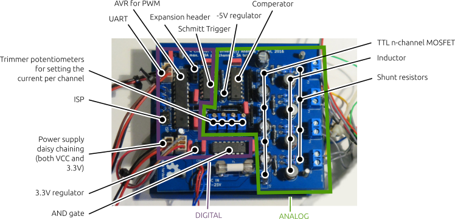

# LED Controller
## 4-channel high power LED buck converter constant current source


This repository contains the schematics and Gerber files for a four-channel high power LED constant current source with integrated 12-bit PWM dimmer. The circuit is built entirely from easily sourceable
through-hole components, and the two-layer PCB can be cheaply manufactured (expect about $15 for ten boards, excl. shipping, total cost of one board will be about $20, with high precision trimmer potentiometers and the ATmega88 AVR microcontroller being the most expensive parts).


## Specifications

* 9x10cm PCB dimension
* 7-25V DC input voltage (stabilised)
* Four independently controllable channels with 4096 PWM steps
* Max. 0.9A per channel, max. 3A total per board
* Daisy-chainable UART
* Automated ramping with configurable speed
* Lots of connections simplifying integration into other projects: small expansion header, power supply headers, fuse holder, DC jack, screwable connection terminals, ...

## About

This board is my first attempt at building a driver for high-power LEDs. LEDs must be driven with a constant current. A simple in-series resistor is often used for low-power LEDs, yet this is not really feasible for the high-power LEDs used in lighting applications due to temperature dependent voltage-current curves. A commonly used constant current source topology with high efficiency is the so called [buck converter](https://en.wikipedia.org/wiki/Buck_converter).

The low-side switched buck converter in this repository was designed from scratch. It does not rely on any specialized circuitry. Bare in mind that you probably shouldn't do this–integrated solutions exist that are much cheaper, smaller, and safer to use. However, they lack most of the learning experience.

The entire circuit was designed on a bread board first. Should you *really* intend to use it, I'd strongly recommend you make yourself familiar with the circuit by doing the same―though in that case you should go with a stripped down one-channel version.

Two of the PCBs are now at the heart of a wake-up light alarm-clock thingy with 36 high power LEDs (4 red, 4 green, 4 blue, 4 yellow, 20 white) in eight channels at 21.5V/300mA each and a total nominal light output of 3600 Lumen. Which is fairly bright. The boards have been tested for several hundred hours.

Schematic and board layout can be opened with [KiCad](http://kicad-pcb.org/). Important parts of the schematic are included as images in the next section (missing: the 3.3V power supply and lots of capacitors, as well as the AVR used for PWM). Final Gerber files for board production can be found in the `gerber` folder.

**⚠ Important:**
This is the first PCB I ever built and I am by no means an electrical engineer! This is just a hobby project. So all the information provided here should be taken with more than just a grain of salt. Use the documentation and schematics provided _at your own risk_. This circuit operates at fairly high currents and frequencies in the 100 kHz range. You are responsible for all shielding required to prevent any interference in the RF spectrum!


## How it works



In the following I'll go through most parts of the circuit diagram and explain them.

### Buck converter constant current source

The basic working principle of the buck converter is as depicted in the following
sketch:


*Case (a):*
When the n-channel MOSFET is conducting, a current flows through the load LED1; the current increases slowly over time due to the inductor L1. The current is monitored over the 1 Ohm shunt resistor pair R6/R7. Once the current reaches a certain threshold *ITh*, the MOSFET is switched off.

*Case (b):*
When the MOSFET is switched off, the magnetic field stored in the inductor maintains the current flow for a while. Once the measured current falls below the threshold current, the MOSFET can be safely switched on again.

Note that the IRLU 120N MOSFET used in the above schematic can be switched using logic-level voltages and does not require additional driver circuitry. You can safely build this circuit on a bread board with a (high-wattage) resistor as load and by manually switching the MOSFET from a 3.3V voltage source (or just using a switch instead of a MOSFET). Using an oscilloscope you should be able to measure something close to the above voltage trace sketches.

**Implementation details:** The shunt resistors R6/R7 must be 0.6W low tolerance resistors. There should be a low-ESR 100µF (or higher) electrolytic capacitor between VCC and GND close to the MOSFET to stabilise the power supply. Remember that the peak current through diode D2 will be the same as the current through your load, so use a fast-switching Schottky diode with corresponding current rating.

### Automating the switching process using a comperator

To build a constant current source we need to automate the switching process. Given a threshold reference voltage *UTh* the basic idea is to just use a comperator integrated circuit such as a LM339. If the measured voltage between IRAW1 in the above schematic and ground is above *UTh*, we switch the transistor on. And as soon as IRAW1 falls below *UTh*, we swtich the transistor off. Sounds simple enough.

A slight complication with this approach is that the comperator does not have infinite [common-mode rejection ratio](https://en.wikipedia.org/wiki/Common-mode_rejection_ratio). Let me unpack this. We are using an n-channel MOSFET as a low-side switch (in other words: the MOSFET switches the connection to ground). On the one hand, this makes controlling the MOSFET really easy, since we can just drive it from 3.3V logic circuitry, such as an AVR microcontroller. On the other hand, low-side switching requires to place the shunt resistor at the high side (close to VCC). Correspondingly, the reference voltage UTh and the sense voltage IRAW1 are both close to VCC (e.g. given a 1 Ohm resistor and a threshold current of 1A, *UTh* = VCC - 1V). A finite common mode rejection ratio means that comperators (or more general, operational amplifiers) do not work well in practice if both input voltages are shifted by a high common DC bias. We need some additional circuitry to shift the voltages towards the operating point of the comperator.


To solve this problem, I'm halving both UTh and IRAW1 using a voltage divider. The voltage divider for IRAW1-4 can be found in subfigure *(a)* of the above diagram. The reference voltage generation is depicted in subfigure *(b)*. Here, I'm using a -5V voltage regulator to generate a voltage of VCC - 5V. A 1k potentiometer with additional 4.7k resistor allows to generate a voltage in the range of about VCC to VCC - 0.8V (use a smaller value than 4.7k to increase the trimmer dynamic range and allow higher currents). This voltage is then divided by two using an additional (impedance matched) voltage divider stage.

Resistor voltage dividers are a crude solution. Their output voltage is highly susceptible to temperature variation and the actual current that is being drawn from the divider. Furthermore, dividing the voltage by two reduces the voltage difference between on- and off-state to a few hundred millivolts. Surprisingly, the solution works quite well in practice, as long as *ITh* is larger than a few tens of millivolts and VCC is constant (read: the driver cannot be used for standard LEDs with 20mA current, and you must use a stabilised DC power supply).

Subfigure *(c)* shows how the reference voltage REF1 and and measured voltage ISENSE1 are fed into the LM339 comperator. The comperator operates in an open-collector fashion, which allows to generate a logic level output signal between 0 and 3.3V using a pullup resistor. This signal is fed into a standard 74HCT04 inverting [Schmitt-Trigger](https://en.wikipedia.org/wiki/Schmitt_trigger), which generates a clean 3.3V binary TTL signal. I'm using a 74HCT08 AND gate to combine the output of the Schmitt trigger with an auxiliary logic signal. The auxiliary signal can be used to switch individual channels on and off and to dim LEDs using [PWM](https://en.wikipedia.org/wiki/Pulse-width_modulation).


### Dimming using pulse-width modulation (PWM)

To dim individual LED channels in 4096 steps I'm using an AVR microcontroller clocked at 8 MHz. Note that the AVR only provides high speed hardware PWM with 256 possible steps. Since brightness perception in biological systems (e.g. humans) is logarithmic, 256 are far to few steps to smoothly change brightness at low brightness values. E.g. the perceived brightness difference between levels "1" and "2" is rather extreme compared to the brightness difference between "254" and "255". To introduce more intermediate steps I'm using a technique called oversampling: the PWM is operated at a frequency 16 times higher than required for flicker-free operation, and the PWM value is slightly varied within each 16-cycle period. This variation depends on the lower 4-bit of the brightness value (marked with `l` in the following diagram).

            12-bit brightness value
            =======================
    
    msb                               lsb
     11 10  9  8  7  6  5  4  3  2  1  0
      h  h  h  h  h  h  h  h  l  l  l  l
     |----------------------|-----------|
          PWM base value     Oversampling

Given the current phase of a 16-cycle period and the `l` values, an additive offset in `{0, 1}` is looked up from the following table:
````c
uint16_t pwm_oversample_data[16] = {
    0b0000'0000'0000'0000, 0b1000'0000'0000'0000, 0b1000'0000'1000'0000,
    0b1000'1000'1000'0000, 0b1000'1000'1000'1000, 0b1001'1000'1000'1000,
    0b1001'1000'1001'1000, 0b1001'1000'1001'1001, 0b1001'1001'1001'1001,
    0b1101'1001'1001'1001, 0b1101'1001'1101'1001, 0b1101'1101'1101'1001,
    0b1101'1101'1101'1101, 0b1111'1101'1101'1101, 0b1111'1101'1111'1101,
    0b1111'1111'1111'1101,
};
````
Each entry corresponds to one of the possible 16 lower 4-bit values, and each bit in the sequence corresponds to an additive offset. The higher the lower 4-bit value, the longer the PWM value will be increased by one. This mechanism works really well in practice! See `src/avr/main.cpp` for more details.

### Controlling and flashing the AVR

The board contains a standard ISP connector for programming (I'm personally using a Raspberry Pi for programming AVR microcontrollers). Compile the software on Linux using the Makefile in the `src/avr` folder (requires an installed AVR `avr-gcc` toolchain). You can control the board with an UART connection using the `src/led_ctrl_host.cpp` program, for example using a cheap USB to UART cable. See `src/avr/bus.hpp` for a set of valid commands. Theoretically, up to 254 boards can be daisy-chained by connecting the TX-pin of one board to the RX-pin of the sibling board.

For example
```bash
./led_ctrl_host 0 2 0x3FFF
```
will set the brightness of the fourth channel (**3**FFF) of the first board (**0**) in the daisy chain to "FFF" (the maximum value),
```bash
./led_ctrl_host 0 1 0x0001
```
will set the ramp speed of of the first channel (**0**FFF) of the first board (**0**) in the daisy chain to the slowest possible value "1" (a value of "0" is off), and
```bash
./led_ctrl_host 0 0xFF 0x0000
```
will reset the first board in the daisy chain.

## How to build and test

Here is a short manual for building and testing the PCB. Be careful and use a current-limited bench power supply for testing.

1. Build the power supply circuitry containing the 3.3V and -5V linear regulators, as well as all low-profile capacitors. Apply power and make sure the correct voltages can be measured on the board (probe the schematic in *KiCad* to find the corresponding places on the PCB).
2. Add all the resistor arrays and the potentiometers. Make sure you can regulate the output voltage of the reference voltage generation stage in the interval between 0.5 * VCC and 0.5 * (VCC - 0.8V).
3. Add all remaining components except for the AVR. Instead, short circuit the AVR output pins (the free AND gate input pins) to 3.3V. Connect a test load (e.g. a 20 Ohm 20 Watt resistor) to the output terminals in series with a multimeter measuring the current. Reduce the current to a small value by adjusting the potentiometers. Replace the test load with your LEDs. Adjust the potentiometers until the desired current is reached (note that the output current gets smaller with increasing PCB temperature).
4. Add and program the ATmega88 (see above). Have fun.


## License

Note that this project consists of both hardware and to a smaller portion of software. Both parts are made available under different licenses.

### Hardware schematics

    Copyright Andreas Stöckel 2016, 2017.
    
    This documentation describes Open Hardware and is licensed under the
    CERN OHL v. 1.2. You may redistribute and modify this documentation under
    the terms of the CERN OHL v.1.2. (http://ohwr.org/cernohl). This
    documentation is distributed WITHOUT ANY EXPRESS OR IMPLIED WARRANTY,
    INCLUDING OF MERCHANTABILITY, SATISFACTORY QUALITY AND FITNESS FOR A
    PARTICULAR PURPOSE. Please see the CERN OHL v.1.2 for applicable conditions.

### Software (AVR firmware and host programs)

    This program is free software: you can redistribute it and/or modify
    it under the terms of the GNU General Public License as published by
    the Free Software Foundation, either version 3 of the License, or
    (at your option) any later version.
    
    This program is distributed in the hope that it will be useful,
    but WITHOUT ANY WARRANTY; without even the implied warranty of
    MERCHANTABILITY or FITNESS FOR A PARTICULAR PURPOSE.  See the
    GNU General Public License for more details.
    
    You should have received a copy of the GNU General Public License
    along with this program.  If not, see <http://www.gnu.org/licenses/>.

